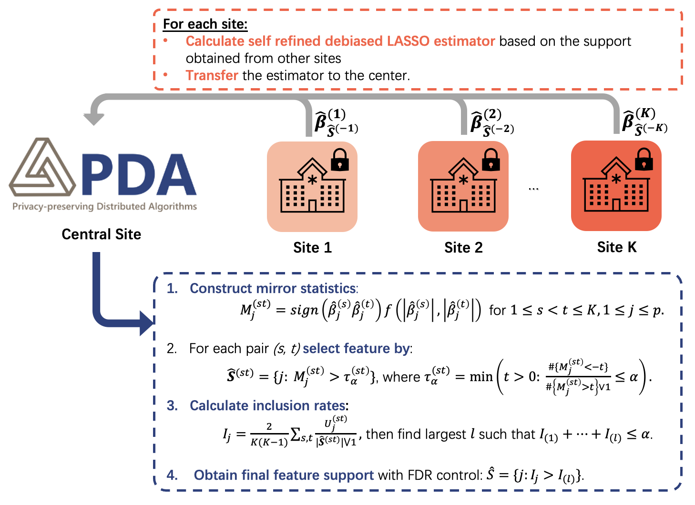

# Fed-FDR: Federated Feature Selection with False Discovery Rate Control


## Outline

1. Description 
2. Fed-FDR workflow
3. Software requirements
4. Reproducing the simulation studies
5. Reproducing the real data analysis
6. Notes on output and reproducibility
7. Support

## 1. Description

This repository contains code to reproduce the simulation studies and the real data analysis reported in the manuscript. All code is written in R. Results are written to `.rds` files and figures are produced from dedicated plotting scripts.

## Fed-FDR Workflow


## 2. Repository layout

### Simulation studies
Folder: `simulation_result`

Scripts to run:
1. `simulation_n500p500.R`
2. `simulation_n500p1000.R`
3. `simulation_n1000p500.R`
4. `simulation_scalebility.R`

### Real data application
Folder: `use case`

Main script:
1. `Table1.R`

Support file loaded by the main script:
1. `Fed_simulation_functions.R`

Sample dataset:
1. `sample_data_to_run.csv`

## 3. Software requirements

1. R version 4.4.1 or later.
2. RStudio is recommended for interactive work.
3. Base R packages only, unless a script prompts you to install an additional package.

## 4. Reproducing the simulation studies

1. Open R or RStudio.
2. Set the working directory to the repository root.
3. Run one or more of the simulation scripts listed above. For example:
   ```r
   source("simulation_result/simulation_n500p500.R")
   source("simulation_result/simulation_n500p1000.R")
   source("simulation_result/simulation_n1000p500.R")
   source("simulation_result/simulation_scalebility.R")
   ```
4. Each script writes its outputs as `.rds` files inside `simulation_result`.
5. To recreate the figures in the manuscript, run:
   ```r
   source("simulation_result/Figure1.R")
   source("simulation_result/Figure2.R")
   source("simulation_result/Figure3.R")
   ```

## 5. Reproducing the real data analysis

1. Open R or RStudio.
2. Set the working directory to the folder `use case`.
3. Ensure the sample dataset `sample_data_to_run.csv` is present in the same folder.
4. Run the main script:
   ```r
   source("use case/Table1.R")
   ```
   The file `Fed_simulation_functions.R` is sourced automatically by `Table1.R`.
5. Outputs are written as `.rds` files inside `use case`.
6. To produce the ROC figure from the manuscript, run:
   ```r
   source("use case/Figure4.R")
   ```
7. Note on generation of synthetic real data for replication:
   
   In this repository, we include a synthetic dataset `sample_data_to_run.csv` that was generated to approximate the structure of the real-world COVID-19 pediatric dataset. The original dataset includes 3,990 patients from 34 clinical sites and 243 binary covariates, but due to privacy and data use restrictions, we cannot share the raw patient-level data. To create a reproducible example, we generated a synthetic dataset with 4,000 patients across 35 clinical sites, containing 243 binary covariates and one binary outcome. The marginal distributions and correlation structure of the features were designed to resemble those of the original dataset, ensuring that the synthetic data are representative for testing and reproducing the analysis pipeline, while containing no identifiable patient information.

## 6. Notes on output and reproducibility

1. All scripts set their own random seeds when applicable. If you require exact replication, do not modify those seeds.
2. Figures are regenerated from the `.rds` result files. If you delete or relocate those files, recreate them by rerunning the corresponding simulation or analysis script.

## 7. Support

For questions about the code or the study design, please open an issue in the repository.
